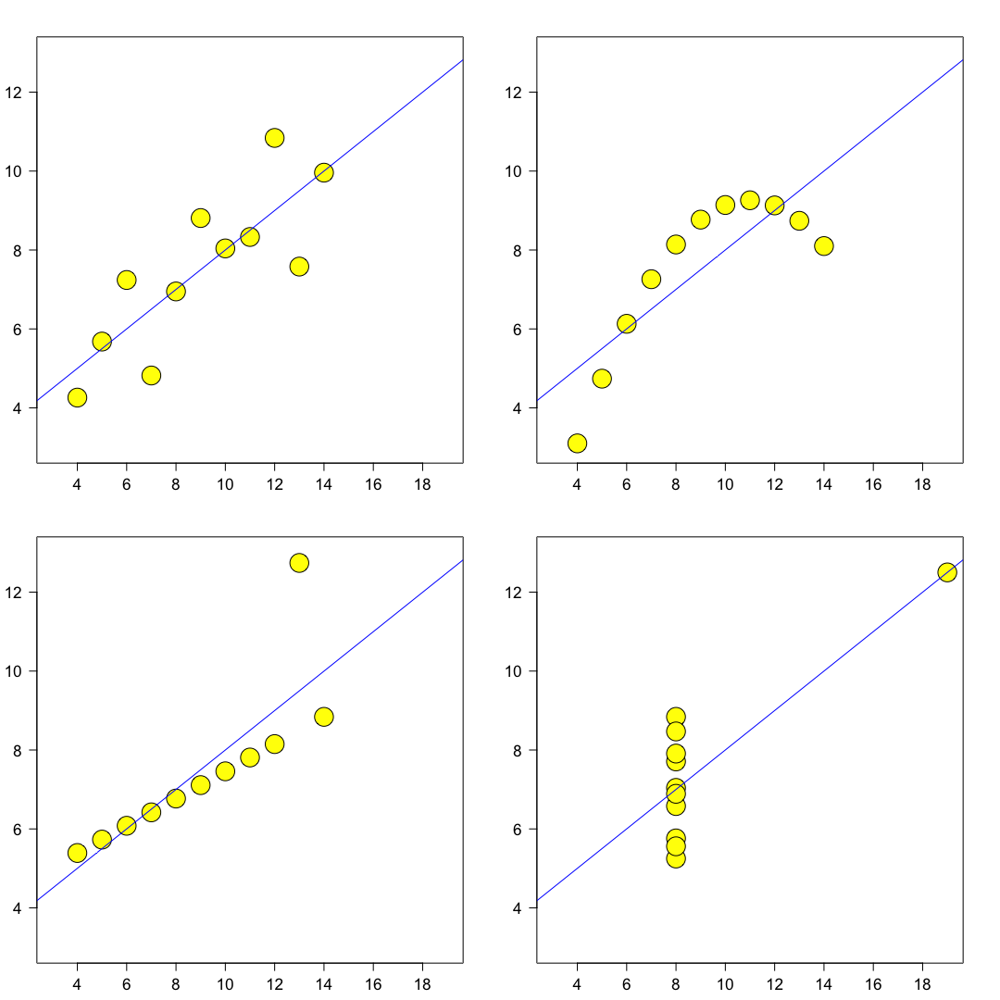
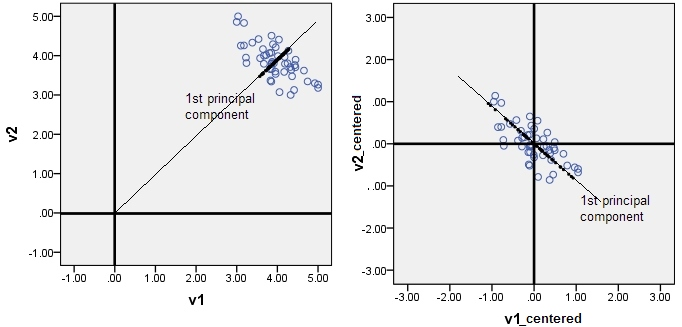

# Principle Component Analysis (PCA)
09/02/2022

## Encounter

*   Eigenvectors are a cooking receipe (linear combination)
*   [Visual explanation](https://setosa.io/ev/principal-component-analysis/)
*   [PCA, t-SNE, UMAP in DS workflow](https://gust.dev/python/dimensionality-reduction)
*   [t-SNE explained](https://towardsdatascience.com/how-to-tune-hyperparameters-of-tsne-7c0596a18868)
*   [t-SNE hyperparameters](https://distill.pub/2016/misread-tsne/)
*   [UMAP hyperparameters](https://jlmelville.github.io/uwot/abparams.html)
*   PCA presevers the (linear) global (high variance!) information

Reduce the number of features without loosing information.

* Why?
  * Curse of dimensionality
  * Perfect feature set: no correlation between them, high correlation with target variable
  * Visualization in higher dimensions impractical

## Statistics

Here a nice intro to [Correlation or Covariance](https://www.mygreatlearning.com/blog/covariance-vs-correlation/#1)

* **Variance** measures how far a set of numbers are spread out from their average value.

  ## $$ \text{Var}(x) = \frac{1}{N-1} \sum_{i=1}^N (x_i - \bar{x})^2$$

  As matrix, if data is centered: $\mathbf{X}\mathbf{X^T}/(n-1)$

  

  * [**Bessel's Correction**](https://en.wikipedia.org/wiki/Bessel%27s_correction) - divide Variance and SD by `n-1` instead of `n` to account for the DFs. Prevent underestimation of population variance

* **Covariance** is when two variables vary with each other (-$\infty$, $\infty$)

  ## $$\text{Cov}(x,y) = \frac{1}{N-1} \sum_{i=1}^N (x_i - \bar{x})(y_i - \bar{y})$$

* **Correlation** is when the change in one variable results in the change in another variable. [$-1$, $1$]

  ## $$\text{Corr}(x,y) = \frac{1}{N-1} \sum_{i=1}^N \frac{(x_i - \bar{x})(y_i - \bar{y})}{\sigma_x \sigma_y}$$

  * **BEWARE**: The value can be misleading! Compare [*Anscombe's quartett*](https://en.wikipedia.org/wiki/Anscombe%27s_quartet), all 4 have very similar characteristics and a correlation coefficient of 0.816!!

    

    

## How

* **Project** data on a subspace with less dimensions
* Projection: $\mathbf{X}\mathbf{W}$ 

* Eigendecomposition 
  Here: **Spectral decomposition** - real symmetric matrix
  General: **SVD** [Single Value Decomposition]

  * $$\mathbf{A}\mathbf{v} = \lambda\mathbf{v}$$

    $$\mathbf{A}\mathbf{Q} = \mathbf{Q}\mathbf{\Lambda}$$

    $$\mathbf{A} = \mathbf{Q}\mathbf{\Lambda}\mathbf{Q}^{-1}$$

##  Questions

* Why is the larger EW the most variability?
  * EW indicates how much a unit vector is stretched
  
* Why do we need to center the data to mean = 0? (image taken from [here](https://stats.stackexchange.com/questions/22329/how-does-centering-the-data-get-rid-of-the-intercept-in-regression-and-pca%20))

    

    The same applies for scaling, the data needs to be scaled to ensure the maximal variance holds the most information is not just based on the unit system

* Why is the projection (geometry) Ev and EW of the Cov matrix?

    Removing **redundancy** means a covariance matrix in which all off-diagonal elements are 0 --> diagonalization!!

    "PCA assumes $\mathbf{P}$ (or $\mathbf{W}$) is an orthonormal basis and the largest variance is the most 'principal'" [taken from here](https://www.cs.princeton.edu/picasso/mats/PCA-Tutorial-Intuition_jp.pdf)

* How to calculate the loadings

    Direction is the EV, multiplying by $\sqrt{\text{EW}}$ set the length to 1

## Drawback (and solutions)

* Assumes linearity -> kernel PCA
  * Select different kernel (Fourier transformation, polar coordinates, ....)
* Gaussian distributed data (mean and variance are sufficient to characterize) --> independent CA (ICA)
  * Keeps linearity, but besides only factorizes the joint probability distribution: $P(\mathbf{y}_i,\mathbf{y_j}) = P(\mathbf{y_i})P(\mathbf{y_j})$
* Principal components are orthogonal