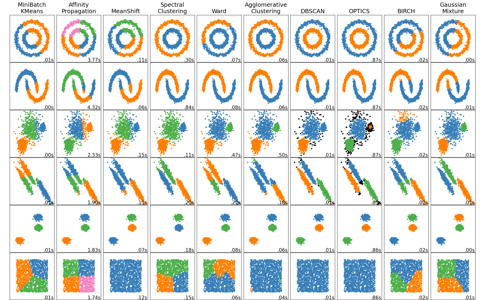

# Clustering

Unsupervised classification in unlabelled data

[Introduction on sklearn](https://scikit-learn.org/stable/modules/clustering.html)

## Methods



### k-NN

​	**What's the difference?**
​	Is that a clustering method?

### `k`-means clustering    

```sklearn.cluster.KMeans```    

* Assign data points to moving centroids until minimal mean squared distance is reached

*   Move `k` centroids to mean position of all assigned data points 

### Hierachical clustering HCA (agglomerative clustering)

```klearn.cluster.AgglomerativeClustering```

* Start with singletons and combine closest data points to the same cluster until desired number is reached

*   Linkage defines closeness between clusters:
    *   `single` - merge clusters with closest minimum distance
    *   `complete` - merge clusters with closes maximum distance
    *   `average` - uses the average pair-wise proximity among all pairs of objects in different clusters
    *   `ward` - chose clusters with minimal weighted squared distance between cluster centers


### DBSCAN 

```sklearn.cluster.DBSCAN```

*   Density based Spatial Clustering of Applications with Noise
*   Chose radius and minimal number of points for **core points**
*   all connected core points are assigned to one cluster
    *    non-core points are assigned afterwards
    *    then the next unconnected core point


## Metrics

### Silhouette score 

[sklearn cluster selection](https://scikit-learn.org/stable/auto_examples/cluster/plot_kmeans_silhouette_analysis.html)

*   $$a(i) = \frac{1}{N_{C_I} - 1} \sum_{j\in C_I, i \neq j}^{N_{C_1}} d(i,j)$$
    *   Describes how well $i$ is defined by the cluster

*   $b(i) = min_{J \neq I}\frac{1}{N_{C_J}} \sum_{j\in C_J} d(i,j)$
    *   Describes minimal distance to neighboring cluster

*   s(i) =$\frac{b(i) - a(i)}{\max\{a(i), b(i)\}}$, if $N_{C_I} > 1$
*   Value between - 1 and 1:
    *   1 = well defined
    *   0 = same cluster
    *   -1 = bad defined

*   Works with any distance metric
*   Works only for spherical clusters

### Distance metrics

[Curse of dimensionality](https://stats.stackexchange.com/questions/99171/why-is-euclidean-distance-not-a-good-metric-in-high-dimensions)

#### Minkovski distance: $$\text{d}(\vec{x}, \vec{y}) = \sum_{i=1}^n (|x_i - y_i|^p)^{\frac{1}{p}}$$

$1$   - Taxicab / Manhatten distance - used in higher dimensional data
$2$   - Euclidean distance - used in lower dimensional data
$\infty$ -  Chebychev distance  - [not used for clustering]

#### Cosine distance $$\vec{x}\cdot\vec{y} = ||\vec{x}||_2\cdot||\vec{y}||_2\cdot\cos{\theta}$$

* Used for text data similarities

#### Rand Index

```sklearn.metrics.rand_score```

* Rand Index: 
  * a : the number of pairs of elements in $S$ that are in the **same** subset in $X$ and in the **same** subset in $Y$
  * b : the number of pairs of elements in $S$ that are in the **different** subset in $X$ and in the **different** subset in $Y$
  * c : the number of pairs of elements in $S$ that are in the **same** subset in $X$ and in the **different** subset in $Y$
  * d : the number of pairs of elements in $S$ that are in the **different** subset in $X$ and in the **same** subset in $Y$
  * $R = \frac{a + b}{a + b + c + d} = \frac{a + b}{\binom{n}{2}}$ can be understood as $RI = \frac{TP + TN}{TP + FP + FN + TN}$

* ARI (adjusted for chance)

  ```sklearn.metrics.adjusted_rand_score```

  * ARI = (RI - Expected_RI) / (max(RI) - Expected_RI)