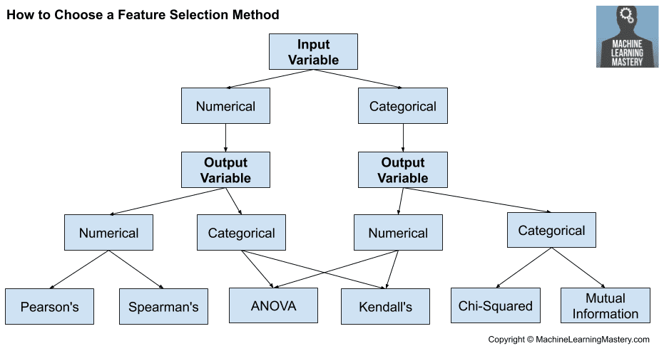

# Feature Seletion
24/01/2022    
One of the core concepts of ML.     
Irrelevant or partially irrelevant features can negatively impact your model performance.    
FS and data cleaning should be first and most important steps.    
Automatically or manually select features which contribute most.

* Reduce overfitting: less likely to model noise
* Improve accuracy: less misleading data
* Reduce training time: Less data to process

## Regression:
* Remove features with **low** correlation with target (dependent variable)
* Remove features with **high** correlation with predictors (independent variables)
  **Multicollinearity** - problem for linear regression
## Classification:
* Remove features with **low** dependency with target (dependent variable)

3 categories:    

1) **Filter methods**, apply methods to filter features, remove subset
2) **Wrapper methods**, employ ML algorithm and use evaluation criteria
3) **Embedded methods**, automatic feature selection in ML algorithm


### Methods



#### **Domain knowledge**

#### **Univariate selection**

```{python}
sklearn.feature_selection.SelectKBest
```

* Can do several tests, e.g. ANOVA, mutual information, chi squared, F-value, ...  

#### **Mutual Information**    

```{python}
sklearn.feature_selection.mutual_info_regression
sklearn.feature_selection.mutual_info_classif
```

If $P_{XY}(x,y) = P_X(x)P_Y(y)$, the joint probability, can be described as the product of the marginal probabilities, X and Y are independent - no mutual information.     
Therefore MI can be described by Kullback-Leibler Divergence:
$$I(X,Y) = D_{KL}\Bigl(P_{XY}(x,y)||P_X(x)P_Y(y)\Bigr)$$

#### **Regularization** (only `L1`)

* LASSO (least absolute shrinkage and selection operator)    
  `L1` penalty    

  ```{python}
  sklearn.linear_model.Lasso
  ```

  Penalizes large weights, but removes small ones

* Ridge regression **NO feature selection**   
  `L2` penalty    

  ```{python}
  sklearn.linear_model.Ridge
  ```

  Strengthes small weights

* ElasticNet    
  `L1` and `L2` penalties    

  ```{python}
  sklearn.linear_model.ElasticNet
  ```

  

#### **Correlation**    

```{python}
ns.heatmap(df.corr('spearman'), annot=True)
```

* Pearson product-moment correlation coefficient (PPMCC)    
    Linear (bivariate) correlation    
    Normalized covariance
    $$\rho_{X,Y} = \frac{\text{cov}(X,Y)}{\sigma_X\sigma_Y}$$
* Spearman's rank correlation coefficient $r$    
    Same as Pearson but applied to the rank variables
    $$r_{s} = \frac{\text{cov}(R(X),R(Y))}{\sigma_{R(X)}\sigma_{R(Y)}}$$
* Kendall's rank correlation coefficient $\tau$    
    Compares concordant versus discordant pairs
    $$\tau = \frac{(\#concordantPairs) - (\#discordantPairs)}{\binom{n}{2}}$$
* General correlation coefficient

#### **ANOVA (analysis of variance)**    

Can a feature seperate distributions in target class    
Compare mean distances and variances

#### **OLS (ordinary linear regression)**    

```statsmodels.api.OLS```
* Null hypothesis is no relationship between two measured phenomena
* p-values from linear regression

#### **Feature Importance**

* MDI (mean decrease in impurity)
* Train RF, examine `feature_importance`
* Look at `coef_` for regression

#### **Recursive Feature Elimination (RFE)**    

```sklearn.feature_selection.RFE```
* Wrapper-type algorithm uses internal filters of methods 
* Recursively removes weakest feature in each run
* Regression and classification

#### **Variance Inflation Factor (VIF)**

* Regression models
Measure of the multicollinearity (ratio of variance of multiivariate model to univariate model)
```statsmodels.stats.outliers_influence.variance_inflation_factor```

#### **Variance Thresholding**     

* Drop features with low variance

#### **Explained variance ratio**

* Linear Discriminant Analysis (LDA)    
    * Get number of relevant features by explained_variance_ratio
* Truncated SVD (TSVD)
    * Get number of relevant features by explained_variance_ratio
* Principal Component Analysis (PCA)
    * Get number of relevant features by explained variance
    * Get features with highest variance

## Plots
* Linear regression on subsets (hue) of data    
  ```{python}
  seaborn.lmplot
  ```

  

## Literature
* [5 Feature Selection Algorithms - TDS](https://towardsdatascience.com/the-5-feature-selection-algorithms-every-data-scientist-need-to-know-3a6b566efd2)
* [Feature Selection for regression - TDS](https://towardsdatascience.com/feature-selection-with-pandas-e3690ad8504b)
* [Feature Importance in Decision Trees and Ramdon Forest - TDS](https://towardsdatascience.com/the-mathematics-of-decision-trees-random-forest-and-feature-importance-in-scikit-learn-and-spark-f2861df67e3)