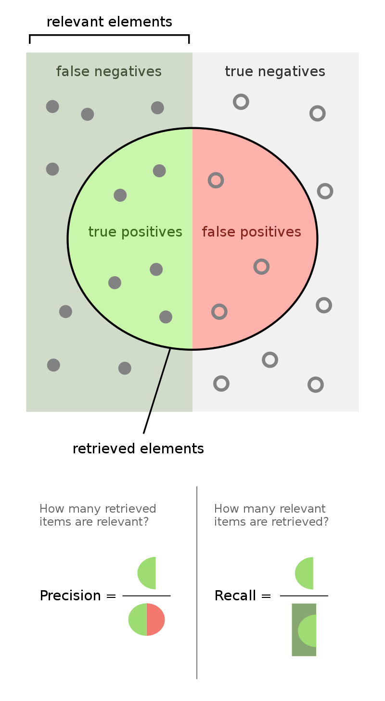
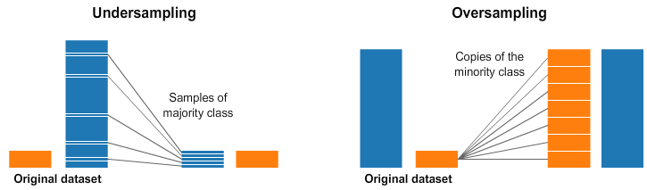
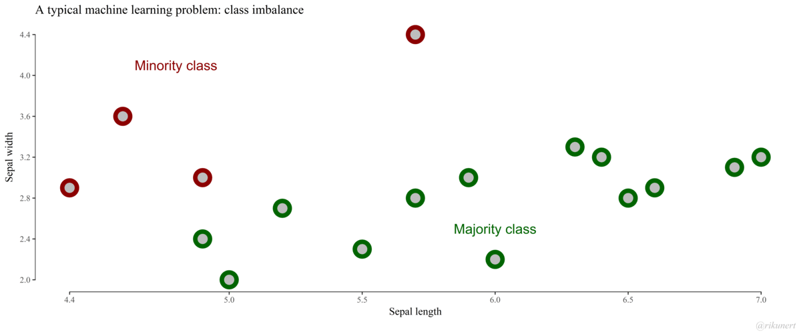
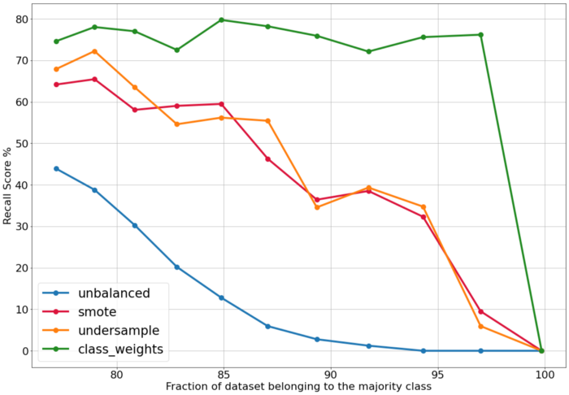

# Class imbalance

04/04/2022

Anomaly or fraud detection

## Situation

​	Data set contains a small number of 'outliers'    
​	Majority vs. minority group

* Use **stratify** to keep ratio in train and test set

## Score

```{python}
from sklearn.metrics import confusion_matrix
```



### Accuracy 

```{python}
from sklearn.metrics import accuracy_score
```

​		$\text{accuracy} = \frac{\text{TP} + \text{TN}}{\text{TP} + \text{FP} + \text{TN} + \text{FN}}$    
​		Rate of correctly labelled over all samples

### 		Precision

```{python}
from sklearn.metrics import precision_score
```

​		also **positive predictive value (PPV)**     
​		$\text{precision} = \frac{\text{TP}}{\text{TP} + \text{FP}}$    
​		Rate of correct positives over all positive classified   

### 		Recall 

```{python}
from sklearn.metrics import recall_score
```

​		also **sensitivity** (in binary classification), **hit rate** or **true positive rate (TPR)**    
​		$\text{recall} = \frac{TP}{\text{P}} = \frac{\text{TP}}{\text{TP} + \text{FN}}$   
​		Rate of correct positives over all positives 

### 	Specificity

​		also **selectivity** or **true negative rate (TNR)**   
​		$\text{sensitivity} = \frac{\text{TN}}{\text{N}} = \frac{\text{TN}}{\text{TN} + \text{FP}}$    
​		Rate of correct negatives over all negatives

### Fall-out 

​		also **false positive rate (FPR)**      
​		$\text{fall-out} = \frac{\text{FP}}{\text{N}} = \frac{\text{FP}}{\text{FP} + \text{TN}}$    
​		Rate of false positives over all negatives

### 		F1 score

```{python}
from sklearn.metrics import f1_score
```

​		Haromic mean of precision and recall
​		$\text{F1} = \frac{2}{\text{precision}^{-1} + \text{recall}^{-1}} = 2 * (\text{precision} * \text{recall}) / (\text{precision} + \text{recall})$

## Sampling



### 		Random Oversampling (RO)

```{python}
from imblearn.over_sampling import RandomOverSampler
```

​		Select random samples from minority class and add them to the data

###			Random Undersampling (RU)

```{python}
from imblearn.under_sampling import RandomUnderSampler
```

​		Select random samples from majority class and remove them from the data

### Near miss (undersampling)

```{python}
from imblearn.under_sampling import NearMiss
```

​		Select samples from majority class based on distance (euclidean) and remove them from the data

## Interpolation (oversampling)



### 		SMOTE (**Synthetic Minority Oversampling Technique**)

```{python}
from imblearn.over_sampling import SMOTE
```

​		Create new samples of minority class by interpolating between kNN
​		Also related methods available SVM SMOTE, borderlineSMOTE, 

### 		ADASYN (Adaptive Synthetic Sampling)

```{python }
from imblearn.over_sampling import ADASYN
```

​		Comparable to SMOTE, uses inverse of density (the lower the density the more points)

## Weights




## Further reading (and source of images)

* [Arithmetic, geometric, harmonic means](https://machinelearningmastery.com/arithmetic-geometric-and-harmonic-means-for-machine-learning/)
* [The different metrics in ML](https://medium.com/mlearning-ai/key-machine-learning-metrics-explained-27d857e53b1b)
* [How to imbalanced data](https://turintech.medium.com/what-is-imbalanced-data-and-how-to-handle-it-369a70be16fc)
* [Use weights instead of SMOTE](https://medium.com/@ali.soleymani.co/stop-using-smote-to-treat-class-imbalance-take-this-intuitive-approach-instead-9cb822b8dc45)
* [Handle class imbalance in text data](https://towardsdatascience.com/how-i-handled-imbalanced-text-data-ba9b757ab1d8#:~:text=The%20simplest%20way%20to%20fix,synthetic%20instances%20from%20minority%20class)
