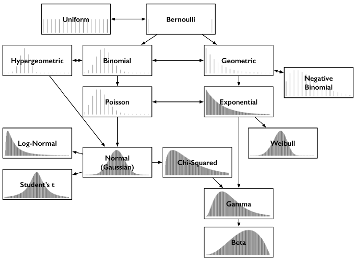

# Distribution functions

21/04/2022

Finding the right distribution:   
1 - Estimate empirical distributions from data (histograms)
2 - Theoretical assumptions (distributions catalog)


### Data types

* **Discrete**:    
  Data that is defined by specific finite values that have no continuous space between one another. Discrete data is *counted.*   
* **Continuous**:    
  Data that exists in a continuous space and can take on any value within that space. Continuous data is *measured.*

### Terminology

**Sample** - subset of population of interest (set of iid observations)  
**Statistics** - summary computed from a sample   
**Observation** - a single measurement in the sample  

**Population** - collection of all items we are interested in   
**Parameter** - summary of population   

**Hypothesis** - description of how the parameter might look like    
**Estimate** - a best guess about the true value of a parameter

### Central limit theorem (CLT)

"When [independent random variables](https://en.wikipedia.org/wiki/Statistical_independence) are summed up, their properly [normalized](https://en.wikipedia.org/wiki/Normalization_(statistics)) sum tends toward a [normal distribution](https://en.wikipedia.org/wiki/Normal_distribution) even if the original variables themselves are not normally distributed." 

### Type of functions

* **PMF (Probability Mass Function)** — a mathematical formula to measure the *probability of drawing a specific value from a discrete data distribution.*

* **PDF (Probability Density Function)** — a mathematical formula to measure the *probability density of different values across a continuous space.*

* **CDF (Cumulative Density Function)** — a mathematical formula to measure the *probability of drawing a sample less than or equal to a certain value*

### Common distributions



* **Normal distribution**
  
  ```{python}
  from numpy.random import normal
  ```
  
  Symmetric
  Mean and median are equal
  Confidence intervals 68.2 % (1 std), 95.5 % (2 std), 99.7 % (3 std)
  
  $$f(x) = \frac{1}{\sigma\sqrt{2\pi}}\exp^{-\frac{1}{2}(\frac{x-\mu}{\sigma})^2}$$
  
* **t-distribution**
  
  ```{python}
  from numpy.random import standard_t
  ```
  
  Shorter and larger tails as normal distribution
  Converges to normal distribution for larger *df* (degrees of freedom)
  
  
  
* **Uniform distribution**

  ```{python}
  from numpy.random import uniform
  ```

  Rolling a fair die

* **Gamma distribution**
  
  ```{python}
  from numpy.random import gamma
  ```
  
  Generalization of exponential and chi squared distribution   
  Predict waiting time until n events occur
  
* **Chi-Squared distribution**

  ```{python}
  from numpy.random import chisquare
  ```

  Chi squared test (normally distributed sum of squared differences)
  Confidence interval, goodness of fit, statistical tests
  Contingency tables (categorical variables)

* **Bernoulli distribution**

  Two possible outcomes, e.g. flipping a coin
  Special case of one trial for binomial distribution

* **Binomial distribution**

  ```{python}
  from numpy.random import binomial
  ```

  Two outcomes, how many successes
  
* **Poisson distribution**

  ```{python}
  from numpy.random import poisson
  ```

  How many times does an event occur in a given time (average rate known)

* **Exponential distribution**
  ```{python}
  from numpy.random import exponential
  ```

  Time between arrivals of events from Poisson distribution
  Waiting time, constant rate

* **Geometric distribution**

  ```{python}
  from numpy.random import geometric
  ```

  Trials until first success

* **Weibull distribution**

  ```{python}
  from numpy.random import weibull
  ```

  Continuous case of geometric distribution
  Waiting times, can model changing rates

### Further reading

* [9 important distributions](https://medium.com/mlearning-ai/9-important-data-distributions-real-world-examples-for-each-b804d9d95fe7)
* [Common distributions](https://medium.com/@srowen/common-probability-distributions-347e6b945ce4)
* [Imoprtant distributions](https://medium.com/towards-data-science/all-probability-distributions-explained-in-six-minutes-fe57b1d49600)