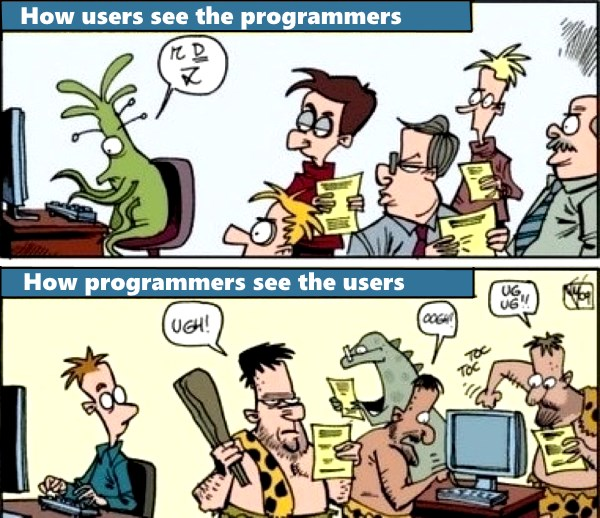

# Program Design
02/02/2022

## Why do you write a program? (instead of a notebook/script)
* Reuseability as a whole
* Clarity
* Extensibility
* Modularity
* **Customers (Users)!!**

## What's the difference to what you did before?
* Complexity
* Size
* Variety of functionality
* Complete in its features

## What's important?
* Reuseability:
    * Readability
    * Conventions -> PEP-8
    * Clear I/O (class level)
    * Exception handling
* Customers
    * Knowledge and understanding of user [**CARE about them!!**])
    * Security
    * Clear I/O (program level)
    * Dumbest Assumable User (DAU)?
    * Exception handling

### Artifacts
1) Idea    
    * User Story: 'Wish', user point of view
    * Requirements Document: Detailed description of user needs
2) Design [[see here for more diagram examples]](https://circle.visual-paradigm.com/diagram-examples/)
    * Pseudocode: Semi-formal description, variables, functions
    * [**Flowchart**](https://press.rebus.community/programmingfundamentals/chapter/flowcharts/): Diagrammatic representation of algorithm
    * [**Data Flow Diagram**](https://www.visual-paradigm.com/guide/data-flow-diagram/what-is-data-flow-diagram/): Only data flow, no decision rules, etc... 
    * [**State Diagram**](https://circle.visual-paradigm.com/category/state-machine/): Description of system behavior (in states)
    * [**Class Diagram**](https://circle.visual-paradigm.com/category/class-diagram/): Unified Modeling Language (UML), static structure diagram
3) Coding Strategies
    * Code + debug: Employ breakpoints and IDE features
    * Prototype: Small toy example of final product
    * Skeleton Code: Empty classes and methods
    * Comment-Driven Development (CDD): Write comments first
    * Test-Driven Development (TDD): Write failing tests first (unit and integration tests)
## Conflict with customers
* You write the software for them! 
* **Care** about their needs, don't get ignorant!
* Adjust the interfaces to them!

